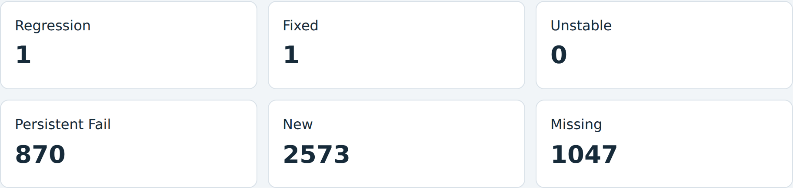

<!-- _class: title -->
<!-- _footer: "" -->
<!-- _paginate: false -->

# kci-dev:
## What Changed, What Works, and What Kernel Developers Still Need

**Arisu Tachibana**
kci-dev creator and project lead
Senior Engineer, Cybertrust Japan Co., Ltd.

Kernel Testing & Dependability MC / LPC 2026<sup class="cite"><a href="https://lpc.events/event/20/contributions/2534/" aria-label="Reference 1">1</a></sup>

<!--
I created kci-dev to make KernelCI useful directly in a kernel developer's workflow, and I continue to lead the project. At last year's LPC, we discussed closing that feedback loop. Today I want to show what we can do now, where the interfaces still fall short, and which workflow we should finish together. I will start with the work since last year, then leave room for discussion.

Sources:
https://lpc.events/event/20/contributions/2534/
https://github.com/aliceinwire/presentations/blob/8653ff4d41ad3854f666aecec43d043a6400f33c/LPC_2025_TALK/LPC_2025_TALK.md
-->

---

## Our work since LPC 2025

- **Reliable automation:** fixed hangs in job watching<sup class="cite"><a href="https://github.com/kernelci/kci-dev/pull/290" aria-label="Reference 1">1</a></sup> and bisection.<sup class="cite"><a href="https://github.com/kernelci/kci-dev/pull/301" aria-label="Reference 2">2</a></sup>
- **Clearer results:** corrected false success reports<sup class="cite"><a href="https://github.com/kernelci/kci-dev/pull/288" aria-label="Reference 3">3</a></sup>, validation<sup class="cite"><a href="https://github.com/kernelci/kci-dev/pull/294" aria-label="Reference 4">4</a></sup> and JSON output.<sup class="cite"><a href="https://github.com/kernelci/kci-dev/pull/295" aria-label="Reference 5">5</a></sup>
- **Python API:** lets existing tools use kci-dev without parsing terminal output.<sup class="cite"><a href="https://github.com/kernelci/kci-dev/pull/277" aria-label="Reference 6">6</a></sup>
- **Broader workflows:** added external build reporting<sup class="cite"><a href="https://github.com/kernelci/kci-dev/pull/266" aria-label="Reference 7">7</a></sup> and patch submission.<sup class="cite"><a href="https://github.com/kernelci/kci-dev/pull/287" aria-label="Reference 8">8</a></sup>

<!--
kci-dev connects kernel developers' tools to KernelCI. Since last year's LPC, our work has focused on making that connection reliable and easier to use.

We fixed cases where watching a job or running a bisection could hang. Rejected retries now report failure, validation checks that result identifiers match, and JSON output gives scripts one readable result document. Each of these changes matters when a person is no longer watching every command. An automation needs a result it can interpret and enough information to recover when something goes wrong.

The reusable Python API lets other tools call kci-dev directly. External build reporting brings results from other build systems into KernelCI, while patchset submission accepts patches against a known base. The two applications we will examine turn these operations into patch review and release review workflows. They show how the work since last year can support tools that maintainers actually use.

Sources:
https://github.com/kernelci/kci-dev/pull/290
https://github.com/kernelci/kci-dev/pull/301
https://github.com/kernelci/kci-dev/pull/288
https://github.com/kernelci/kci-dev/pull/294
https://github.com/kernelci/kci-dev/pull/295
https://github.com/kernelci/kci-dev/pull/277
https://github.com/kernelci/kci-dev/pull/266
https://github.com/kernelci/kci-dev/pull/287
-->

---

## A maintainer's question

### What changed for my kernel?

- Which revision and configuration did we test?
- Which failures appeared with my change?
- Do we have enough evidence to act?

kci-dev brings KernelCI data into scripts and review workflows.<sup class="cite"><a href="https://github.com/kernelci/kci-dev/blob/e4c00874f1bcfbd6a6f1cdd513320b2e95713a42/README.md" aria-label="Reference 1">1</a>,<a href="https://github.com/kernelci/kci-dev/blob/e4c00874f1bcfbd6a6f1cdd513320b2e95713a42/kcidev/libs/regression.py" aria-label="Reference 2">2</a></sup>

<!--
Imagine you are reviewing a patch series or preparing a stable update. You have a baseline and a candidate. KernelCI has results, but the decision still needs context. A failure count alone does not tell you whether the candidate introduced a problem. A different board, compiler or configuration can change what you are comparing. A missing test can also make the candidate look better than it really is.

The useful question is what changed for this kernel, under comparable conditions, and what should the maintainer investigate next. That is the workflow I want kci-dev to support. We already have several of the operations we need. The remaining work is to connect them with explicit expectations about evidence and coverage.

Sources:
https://github.com/kernelci/kci-dev/blob/e4c00874f1bcfbd6a6f1cdd513320b2e95713a42/README.md
https://github.com/kernelci/kci-dev/blob/e4c00874f1bcfbd6a6f1cdd513320b2e95713a42/kcidev/libs/regression.py
-->

---

<!-- _class: overview -->

## What changed since LPC 2025

| Available by v0.1.11 | What it enables |
| :--- | :--- |
| Python client | Import kci-dev into other tools<sup class="cite"><a href="https://github.com/kernelci/kci-dev/tree/v0.1.11" aria-label="Reference 1">1</a></sup> |
| KCIDB submission + storage | Report external builds and upload artifacts<sup class="cite"><a href="https://github.com/kernelci/kci-dev/blob/v0.1.11/kcidev/subcommands/storage.py" aria-label="Reference 2">2</a></sup> |
| Patchset submission | Test local patches or allowed patch URLs<sup class="cite"><a href="https://github.com/kernelci/kci-dev/blob/v0.1.11/docs/patchset.md" aria-label="Reference 3">3</a></sup> |
| Validation + workflow fixes | Check consistency and improve automation<sup class="cite"><a href="https://github.com/kernelci/kci-dev/tree/v0.1.11" aria-label="Reference 1">1</a></sup> |

**Current main:** structured comparison reports and CI gates<sup class="cite"><a href="https://github.com/kernelci/kci-dev/compare/v0.1.11...e4c00874f1bcfbd6a6f1cdd513320b2e95713a42" aria-label="Reference 4">4</a></sup>

Source snapshot: 6 October 2026, `e4c0087`. MCP remains experimental.<sup class="cite"><a href="https://github.com/kernelci/kci-dev/blob/v0.1.11/docs/mcp.md" aria-label="Reference 5">5</a></sup>

<!--
Last year's slides included a reusable library as a priority. By v0.1.11 we had a public Python client, alongside the command-line interface. That lets another application call kci-dev and work with Python objects. External build systems can also construct and submit KCIDB build results, with separate storage commands for their artifacts.

Patchset submission is another concrete step. We can submit local patch files or allowed patch URLs against an existing checkout. Validation, job watching and bisection have also received attention, together with packaging and machine-readable reports.

There is an important version distinction here. The structured comparison and gate examples later in this talk use current main, beyond the v0.1.11 tag. The optional MCP server exists in the release, but its interface remains experimental. These are different levels of availability, so a workflow should pin the version it actually uses.

Sources:
https://github.com/kernelci/kci-dev/tree/v0.1.11
https://github.com/kernelci/kci-dev/compare/v0.1.11...e4c00874f1bcfbd6a6f1cdd513320b2e95713a42
https://github.com/kernelci/kci-dev/blob/v0.1.11/docs/patchset.md
https://github.com/kernelci/kci-dev/blob/v0.1.11/kcidev/subcommands/storage.py
https://github.com/kernelci/kci-dev/blob/v0.1.11/docs/mcp.md
-->

---

<!-- _class: code-slide -->

## A reusable Python interface

```python
from kcidev import KernelCIClient

client = KernelCIClient()
summary = client.get_summary(
    origin="maestro", giturl=GIT_URL,
    branch=BRANCH, commit=COMMIT,
)
```

Dashboard queries return Python objects.<sup class="cite"><a href="https://github.com/kernelci/kci-dev/blob/v0.1.11/README.md#using-kci-dev-as-a-python-library" aria-label="Reference 1">1</a></sup>
`submit_build(...)` reports an external build to KCIDB.<sup class="cite"><a href="https://github.com/kernelci/kci-dev/blob/v0.1.11/kcidev/api.py" aria-label="Reference 2">2</a></sup>

<!--
This is the small integration example I want people to take away. The caller supplies a repository URL, branch and full commit hash. The public client makes the Dashboard request and returns the result as Python data. Public Dashboard queries do not require a KernelCI submission token.

That gives a patch review service or release report a direct interface. It can keep the result in its own workflow and handle recoverable failures through KciDevError. It does not need to parse terminal tables. For an external build system, submit_build constructs and submits a build result using configured KCIDB credentials. It reports a build that the caller has already performed.

The boundary matters. kci-dev provides the client operations. The integrating application still owns its trigger policy, credentials and decision about what a result means. GIT_URL, BRANCH and COMMIT here are values supplied by that application.

Sources:
https://github.com/kernelci/kci-dev/blob/v0.1.11/README.md#using-kci-dev-as-a-python-library
https://github.com/kernelci/kci-dev/blob/v0.1.11/kcidev/api.py
-->

---

<!-- _class: plugins -->

## Example plugins using the Python API

| Application | Workflow it adds | Shared client methods |
| :--- | :--- | :--- |
| `kci-patchwork` | Test a Patchwork series on a known base | `trigger_patchset`, `get_node`, `get_nodes`<sup class="cite"><a href="https://github.com/aliceinwire/kci-patchwork/blob/1acedb7ab59a2bf8ab9934c4cf76727552c04b10/docs/workflow.md#L5-L12" aria-label="Reference 1">1</a>,<a href="https://github.com/aliceinwire/kci-patchwork/blob/1acedb7ab59a2bf8ab9934c4cf76727552c04b10/kci_patchwork/workflow.py#L230-L285" aria-label="Reference 2">2</a></sup> |
| `kci_release_review` | Compare tested revisions and publish reports | `compare_results`, `get_build`, `get_test`, `get_log`<sup class="cite"><a href="https://github.com/aliceinwire/kci_release_review/blob/b328d0a60e46a1c7062d36b2d062d0fcac7ac442/kci_release_review/client.py" aria-label="Reference 3">3</a>,<a href="https://github.com/aliceinwire/kci_release_review/blob/b328d0a60e46a1c7062d36b2d062d0fcac7ac442/kci_release_review/report.py" aria-label="Reference 4">4</a></sup> |

Standalone Python applications importing `KernelCIClient`.<sup class="cite"><a href="https://github.com/aliceinwire/kci-patchwork/blob/1acedb7ab59a2bf8ab9934c4cf76727552c04b10/docs/workflow.md#L5-L12" aria-label="Reference 1">1</a>,<a href="https://github.com/aliceinwire/kci_release_review/blob/b328d0a60e46a1c7062d36b2d062d0fcac7ac442/kci_release_review/client.py" aria-label="Reference 3">3</a></sup>

<!--
These are examples of plugins built around the reusable interface. Here, plugin means a separate application that imports kci-dev. Neither application requires a plugin registration mechanism inside the command-line tool. They can have their own commands, release cycles and report formats while sharing the same client operations.

kci-patchwork owns the Patchwork-specific work: resolving a URL, obtaining the complete series, preserving patch order and recording a submission. kci_release_review owns the release-facing presentation of comparisons and their evidence. Both call Python methods directly instead of interpreting terminal tables.

The library boundary does not make every workflow identical. Patchwork needs Maestro node and patchset identities. Release review compares explicit commits already represented in the Dashboard. Keeping that difference visible lets us reuse the service access without throwing away the identities each workflow needs. Both applications pin a specific library revision so their examples have a reproducible API contract.

Sources:
https://github.com/aliceinwire/kci-patchwork/blob/1acedb7ab59a2bf8ab9934c4cf76727552c04b10/docs/workflow.md#L5-L12
https://github.com/aliceinwire/kci-patchwork/blob/1acedb7ab59a2bf8ab9934c4cf76727552c04b10/kci_patchwork/workflow.py#L230-L285
https://github.com/aliceinwire/kci_release_review/blob/b328d0a60e46a1c7062d36b2d062d0fcac7ac442/kci_release_review/client.py
https://github.com/aliceinwire/kci_release_review/blob/b328d0a60e46a1c7062d36b2d062d0fcac7ac442/kci_release_review/report.py
-->

---

<!-- _class: code-slide -->

## Patches on a known base

```bash
kci-dev patchset --nodeid "$CHECKOUT_NODE" \
  --patch 0001-fix.patch \
  --patch 0002-test.patch \
  --job-filter "$JOB_FILTER" \
  --watch --test "$TEST_PATH"
```

Requires an existing checkout and a configured pipeline/token.<sup class="cite"><a href="https://github.com/kernelci/kci-dev/blob/e4c00874f1bcfbd6a6f1cdd513320b2e95713a42/docs/patchset.md" aria-label="Reference 1">1</a>,<a href="https://github.com/aliceinwire/kci-patchwork/blob/1acedb7ab59a2bf8ab9934c4cf76727552c04b10/docs/workflow.md#L102-L149" aria-label="Reference 2">2</a></sup>

`--patchurl` accepts allowed URLs, including Patchwork mbox URLs.<sup class="cite"><a href="https://github.com/kernelci/kci-dev/blob/e4c00874f1bcfbd6a6f1cdd513320b2e95713a42/docs/patchset.md" aria-label="Reference 1">1</a></sup>

<!--
This is the underlying command-line operation. First create or select a checkout of the intended base revision. Its checkout_nodeid becomes CHECKOUT_NODE here. Submit the patches in their intended order and select jobs available on that pipeline. The watch option can wait for the named test.

There are two submission forms. Local text patches go through patch, while patchurl sends URLs from a domain the pipeline permits. A request uses one form or the other. The documented inline limits are thirty-two patches, up to ten mebibytes each, and binary patches are not supported.

The application example adds the work around this operation. It freezes the series, remembers the base and returned identifiers, follows the resulting tree and prepares a report. Its captured CIP run later in the deck demonstrates submission and collection while jobs remain active. That particular capture does not yet establish the outcome of the patched build or its comparison with the baseline.

Sources:
https://github.com/kernelci/kci-dev/blob/e4c00874f1bcfbd6a6f1cdd513320b2e95713a42/docs/patchset.md
https://github.com/aliceinwire/kci-patchwork/blob/1acedb7ab59a2bf8ab9934c4cf76727552c04b10/docs/workflow.md#L102-L149
User-provided CIP series 1178390 command and running-result excerpt, reproduced in notes/evidence/patchwork-series-1178390.json.
-->

---

## Choosing the base and the jobs

- The checkout identifies the unpatched source revision and tarball.<sup class="cite"><a href="https://github.com/aliceinwire/kci-patchwork/blob/1acedb7ab59a2bf8ab9934c4cf76727552c04b10/docs/workflow.md#L65-L100" aria-label="Reference 1">1</a></sup>
- The series must apply to that revision.<sup class="cite"><a href="https://github.com/aliceinwire/kci-patchwork/blob/1acedb7ab59a2bf8ab9934c4cf76727552c04b10/docs/workflow.md#L65-L100" aria-label="Reference 1">1</a></sup>
- Job filters select builds and tests available on that instance.<sup class="cite"><a href="https://github.com/aliceinwire/kci-patchwork/blob/1acedb7ab59a2bf8ab9934c4cf76727552c04b10/docs/workflow.md#L65-L100" aria-label="Reference 1">1</a></sup>
- The configuration must exercise the code the series changes.<sup class="cite"><a href="https://github.com/aliceinwire/kci-patchwork/blob/1acedb7ab59a2bf8ab9934c4cf76727552c04b10/README.md#L104-L115" aria-label="Reference 2">2</a></sup>

A passing build provides evidence for the configuration that ran.<sup class="cite"><a href="https://github.com/aliceinwire/kci-patchwork/blob/1acedb7ab59a2bf8ab9934c4cf76727552c04b10/README.md#L104-L115" aria-label="Reference 2">2</a></sup>

<!--
The checkout argument is a KernelCI node identifier, rather than a Git branch name or a Patchwork series identifier. That node gives the pipeline a source revision and a tarball on which to apply the series. It also supplies the baseline that the application will later inspect.

Choose the base from the tree the series targets. The most recent checkout on an unrelated branch is not a useful substitute. Preparation checks metadata and the source-tarball reference, but actual patch applicability belongs to the pipeline stage that applies the patches.

Job selection is a separate decision. A small configuration is useful to exercise submission and compilation, but it may leave the modified driver disabled. For a CIP series, use the intended CIP revision and a supported job, then decide whether a boot or focused test is also needed. The captured command uses an ARM64 CIP build job. Its name alone does not establish coverage of every change in the series.

Sources:
https://github.com/aliceinwire/kci-patchwork/blob/1acedb7ab59a2bf8ab9934c4cf76727552c04b10/README.md#L104-L115
https://github.com/aliceinwire/kci-patchwork/blob/1acedb7ab59a2bf8ab9934c4cf76727552c04b10/docs/workflow.md#L65-L100
-->

---

## kci-patchwork: a series workflow

1. Resolve the Patchwork URL to a complete series.<sup class="cite"><a href="https://github.com/aliceinwire/kci-patchwork/blob/1acedb7ab59a2bf8ab9934c4cf76727552c04b10/README.md#L56-L75" aria-label="Reference 1">1</a></sup>
2. Validate patch order and freeze the exact diffs.<sup class="cite"><a href="https://github.com/aliceinwire/kci-patchwork/blob/1acedb7ab59a2bf8ab9934c4cf76727552c04b10/kci_patchwork/patchwork.py#L207-L284" aria-label="Reference 2">2</a></sup>
3. Record the base, selected jobs and submission identifiers.<sup class="cite"><a href="https://github.com/aliceinwire/kci-patchwork/blob/1acedb7ab59a2bf8ab9934c4cf76727552c04b10/kci_patchwork/workflow.py#L101-L147" aria-label="Reference 3">3</a></sup>
4. Collect the patched tree and compare completed results.<sup class="cite"><a href="https://github.com/aliceinwire/kci-patchwork/blob/1acedb7ab59a2bf8ab9934c4cf76727552c04b10/kci_patchwork/results.py#L106-L200" aria-label="Reference 4">4</a></sup>

`manifest.json` records the inputs.<sup class="cite"><a href="https://github.com/aliceinwire/kci-patchwork/blob/1acedb7ab59a2bf8ab9934c4cf76727552c04b10/kci_patchwork/workflow.py#L101-L147" aria-label="Reference 3">3</a></sup> HTML and JSON reports retain the evidence.<sup class="cite"><a href="https://github.com/aliceinwire/kci-patchwork/blob/1acedb7ab59a2bf8ab9934c4cf76727552c04b10/docs/workflow.md#L189-L192" aria-label="Reference 5">5</a></sup>

<!--
A Patchwork URL is a useful input because it identifies the series in the place where review already happens. The application accepts series links and project-list links with a series parameter, including the CIP example that follows. It can also use other servers that expose a compatible public Patchwork API.

A series can contain several patches. The application checks sequence information and requires a complete order rather than assuming that IDs or mail dates give the correct sequence. It writes the selected diffs and their checksums to the run directory, together with the series version and checkout metadata.

Preparation can stop there for inspection. Adding submit starts the KernelCI operation and records the returned node and tree. Subsequent collection is tied to those identifiers. When the patched tree has terminal results, the application reads the original checkout and compares matching job subtrees. This gives a reviewer a report tied to a particular set of inputs.

Sources:
https://github.com/aliceinwire/kci-patchwork/blob/1acedb7ab59a2bf8ab9934c4cf76727552c04b10/README.md#L56-L75
https://github.com/aliceinwire/kci-patchwork/blob/1acedb7ab59a2bf8ab9934c4cf76727552c04b10/kci_patchwork/patchwork.py#L207-L284
https://github.com/aliceinwire/kci-patchwork/blob/1acedb7ab59a2bf8ab9934c4cf76727552c04b10/kci_patchwork/workflow.py#L101-L147
-->

---

<!-- _class: command-example -->

## CIP series submission

```bash
kci-patchwork \
  "https://patchwork.kernel.org/project/cip-dev/list/?series=1178390" \
  --config ~/.config/kci-dev/kci-dev.toml \
  --instance staging \
  --checkout 6ab272040ed308c6c2d206c3 \
  --job kbuild-gcc-14-arm64-510-cip \
  --submit
```

Captured command: one series, an explicit base and a selected CIP build.<sup class="cite"><a href="https://github.com/aliceinwire/presentations/blob/d229b41811446f79a7810160a7c98e86b7b1f3de/LPC_2026_MC/notes/evidence/patchwork-series-1178390.json" aria-label="Reference 1">1</a>,<a href="https://github.com/aliceinwire/kci-patchwork/blob/1acedb7ab59a2bf8ab9934c4cf76727552c04b10/README.md#L19-L47" aria-label="Reference 2">2</a>,<a href="https://github.com/aliceinwire/kci-patchwork/blob/1acedb7ab59a2bf8ab9934c4cf76727552c04b10/kci_patchwork/__main__.py#L250-L345" aria-label="Reference 3">3</a></sup>

<!--
This is the command used for the captured run. The URL names series 1178390 in the cip-dev project. The explicit staging profile supplies the KernelCI endpoints and credentials. The checkout argument names the unpatched base, and the job filter selects the ARM64 CIP build.

The short URL-first command is equivalent to the run subcommand. With submit present, it prepares the local inputs, submits the patchset and watches the resulting nodes. Without submit, the same workflow produces a prepared run and reports for inspection without starting jobs.

The base node and job shown here belong to this recorded staging example. Someone adapting it should select a suitable current checkout and a job supported by their instance. The run directory is also significant: it is where the application remembers that a submission has already been attempted. For this capture the default path is runs/patchwork.kernel.org/series-1178390. We can return to that directory to collect new evidence.

Sources:
User-provided command for CIP series 1178390.
https://github.com/aliceinwire/kci-patchwork/blob/1acedb7ab59a2bf8ab9934c4cf76727552c04b10/README.md#L19-L47
https://github.com/aliceinwire/kci-patchwork/blob/1acedb7ab59a2bf8ab9934c4cf76727552c04b10/kci_patchwork/__main__.py#L250-L345
-->

---

<!-- _class: captured-output -->

## Captured Patchwork run

```json
{
  "status": "RUNNING", "exit_code": 3,
  "terminal": false,
  "counts": {"total": 2, "descendants": 1,
             "states": {"closing": 1, "running": 1},
             "results": {"pass": 1, "unset": 1}},
  "comparison": {"performed": false, "complete": false}
}
```

Submission and result collection are active.<sup class="cite"><a href="https://github.com/aliceinwire/presentations/blob/d229b41811446f79a7810160a7c98e86b7b1f3de/LPC_2026_MC/notes/evidence/patchwork-series-1178390.json" aria-label="Reference 1">1</a>,<a href="https://github.com/aliceinwire/kci-patchwork/blob/1acedb7ab59a2bf8ab9934c4cf76727552c04b10/kci_patchwork/results.py#L9-L102" aria-label="Reference 2">2</a></sup>
The completed build comparison is still pending in this capture.<sup class="cite"><a href="https://github.com/aliceinwire/presentations/blob/d229b41811446f79a7810160a7c98e86b7b1f3de/LPC_2026_MC/notes/evidence/patchwork-series-1178390.json" aria-label="Reference 1">1</a>,<a href="https://github.com/aliceinwire/kci-patchwork/blob/1acedb7ab59a2bf8ab9934c4cf76727552c04b10/docs/workflow.md#L168-L214" aria-label="Reference 3">3</a></sup>

<!--
This is an excerpt of the output supplied for the CIP run, not a simulated successful result. The application has observed two nodes, including one descendant. One result is pass and the other is unset. Their states are closing and running, and the terminal flag is false.

Those fields explain why the application reports RUNNING with exit code three. They demonstrate that submission has progressed into result collection and that the tool can produce a structured report for the run. The summary does not identify the passing node as a completed build, so we should not interpret the single pass count that way.

The comparison fields are equally useful. They explicitly say that baseline comparison has not been performed. The full output states that comparison starts once the patched tree has complete terminal results, and gives paths to report.html and report.json. A later status request can update that evidence. This capture supports the working submission and monitoring path, while leaving the eventual build and comparison outcome open.

Sources:
User-provided CIP run excerpt. Complete supplied JSON is retained in notes/evidence/patchwork-series-1178390.json.
https://github.com/aliceinwire/kci-patchwork/blob/1acedb7ab59a2bf8ab9934c4cf76727552c04b10/docs/workflow.md#L168-L214
https://github.com/aliceinwire/kci-patchwork/blob/1acedb7ab59a2bf8ab9934c4cf76727552c04b10/kci_patchwork/results.py#L9-L102
-->

---

<!-- _class: code-slide -->

## Continuing the same Patchwork run

```bash
RUN=runs/patchwork.kernel.org/series-1178390
kci-patchwork status --run "$RUN"
kci-patchwork watch --run "$RUN"
```

- `report.html`: readable results and baseline comparisons<sup class="cite"><a href="https://github.com/aliceinwire/kci-patchwork/blob/1acedb7ab59a2bf8ab9934c4cf76727552c04b10/docs/workflow.md#L126-L166" aria-label="Reference 1">1</a></sup>
- `report.json`: nodes, classifications and collection errors<sup class="cite"><a href="https://github.com/aliceinwire/kci-patchwork/blob/1acedb7ab59a2bf8ab9934c4cf76727552c04b10/docs/workflow.md#L126-L166" aria-label="Reference 1">1</a></sup>
- The saved run retains the submitted node and tree IDs.<sup class="cite"><a href="https://github.com/aliceinwire/kci-patchwork/blob/1acedb7ab59a2bf8ab9934c4cf76727552c04b10/kci_patchwork/workflow.py#L230-L317" aria-label="Reference 2">2</a></sup>

<!--
These commands continue observation of the saved run. Status collects a snapshot, and watch continues polling. They use the recorded endpoints and submitted identifiers. Restarting observation should not require preparing or submitting the series again.

The application writes its attempt record before making the submission request. It refuses a repeated submission for that run directory, including when the original request has an uncertain outcome. That protection depends on preserving the directory. Preparing a different run directory is a separate operation and can create another submission.

For an ordinary active run, status or watch refreshes the HTML and JSON reports. Once the patched tree has complete terminal results, collection also reads the saved baseline and compares matching results. If a request was interrupted before a reliable response, the application has an explicit reconciliation path for an operator to identify the original submission. This is a workflow concern that belongs around the library method, and the saved state makes it manageable.

Sources:
https://github.com/aliceinwire/kci-patchwork/blob/1acedb7ab59a2bf8ab9934c4cf76727552c04b10/docs/workflow.md#L126-L166
https://github.com/aliceinwire/kci-patchwork/blob/1acedb7ab59a2bf8ab9934c4cf76727552c04b10/kci_patchwork/workflow.py#L230-L317
-->

---

<!-- _class: code-slide -->

## Patchset identity in the Python API

```python
response = client.trigger_patchset(
    nodeid=base_id, patches=ordered_diffs,
    job_filter=[job],
)
patchset = response["node"]
root = client.get_node(patchset["id"])
```

Patched and unpatched trees can share a Git commit hash.<sup class="cite"><a href="https://github.com/kernelci/kci-dev/blob/e4c00874f1bcfbd6a6f1cdd513320b2e95713a42/kcidev/api.py" aria-label="Reference 1">1</a>,<a href="https://github.com/aliceinwire/kci-patchwork/blob/1acedb7ab59a2bf8ab9934c4cf76727552c04b10/docs/workflow.md#L168-L187" aria-label="Reference 2">2</a></sup>
Collection also uses the patchset hash, tree ID and parent chain.<sup class="cite"><a href="https://github.com/aliceinwire/kci-patchwork/blob/1acedb7ab59a2bf8ab9934c4cf76727552c04b10/kci_patchwork/workflow.py#L194-L273" aria-label="Reference 3">3</a>,<a href="https://github.com/aliceinwire/kci-patchwork/blob/1acedb7ab59a2bf8ab9934c4cf76727552c04b10/kci_patchwork/comparison.py#L9-L79" aria-label="Reference 4">4</a></sup>

<!--
This abbreviated Python example shows the shared operation that kci-patchwork calls. The configured client submits ordered diff strings against the chosen base and returns the patchset node. The application persists the returned node and tree identifiers before later collection.

A patchset retains the original Git commit hash and adds patchset identity. Consequently, a commit-only query is insufficient to distinguish the base from the patched source. kci-patchwork uses get_node and paginated get_nodes queries filtered to the returned tree. It checks the patchset hash and parent relationships before interpreting descendant results.

Its baseline comparison matches the relative job ancestry and execution configuration. Architecture, compiler, configuration and platform help establish that two results are comparable. Ambiguous matches or incomplete collections stay visible as incomplete evidence. This is why the Patchwork application uses a comparison adapted to Maestro nodes, while the release-review application can reuse the Dashboard's commit-based comparison directly. Both reuse the same Python client for service access.

Sources:
https://github.com/kernelci/kci-dev/blob/e4c00874f1bcfbd6a6f1cdd513320b2e95713a42/kcidev/api.py
https://github.com/aliceinwire/kci-patchwork/blob/1acedb7ab59a2bf8ab9934c4cf76727552c04b10/kci_patchwork/workflow.py#L194-L273
https://github.com/aliceinwire/kci-patchwork/blob/1acedb7ab59a2bf8ab9934c4cf76727552c04b10/docs/workflow.md#L168-L187
https://github.com/aliceinwire/kci-patchwork/blob/1acedb7ab59a2bf8ab9934c4cf76727552c04b10/kci_patchwork/comparison.py#L9-L79
-->

---

<!-- _class: code-slide -->

## Comparing two revisions

```bash
kci-dev results compare \
  --giturl "$GIT_URL" --branch "$BRANCH" \
  --format json "$BASE" "$HEAD"
```

**Current main:** explicit full commit hashes and structured output<sup class="cite"><a href="https://github.com/kernelci/kci-dev/blob/e4c00874f1bcfbd6a6f1cdd513320b2e95713a42/docs/results.md" aria-label="Reference 1">1</a>,<a href="https://github.com/kernelci/kci-dev/blob/e4c00874f1bcfbd6a6f1cdd513320b2e95713a42/kcidev/api.py" aria-label="Reference 2">2</a></sup>

Matches origin, platform, arch, compiler, config and path.<sup class="cite"><a href="https://github.com/kernelci/kci-dev/blob/e4c00874f1bcfbd6a6f1cdd513320b2e95713a42/kcidev/libs/regression.py" aria-label="Reference 3">3</a></sup>
Keeps repeated results and their IDs.<sup class="cite"><a href="https://github.com/kernelci/kci-dev/blob/e4c00874f1bcfbd6a6f1cdd513320b2e95713a42/kcidev/libs/regression.py" aria-label="Reference 3">3</a></sup>

<!--
Now we have results for a baseline and a candidate. Current main can compare the two explicit commit hashes and return a structured report. I use explicit hashes here because a review needs to remain tied to the revisions we intended to compare. The default latest-two-checkouts mode is convenient for exploration, but its inputs can change as new results arrive.

The implementation groups results by their execution identity. That includes the origin, platform, architecture, compiler, configuration and test path, with builds, boots and tests handled separately. It preserves repeated results instead of simply overwriting them.

The report carries the two commits, category counts and individual result identifiers, plus an incomplete flag. Optional known-issue lookup adds requests, so it has a cost. This gives another program useful evidence to inspect. It still depends on the quality of the metadata and the scope of the results returned by the backend.

Sources:
https://github.com/kernelci/kci-dev/blob/e4c00874f1bcfbd6a6f1cdd513320b2e95713a42/docs/results.md
https://github.com/kernelci/kci-dev/blob/e4c00874f1bcfbd6a6f1cdd513320b2e95713a42/kcidev/api.py
https://github.com/kernelci/kci-dev/blob/e4c00874f1bcfbd6a6f1cdd513320b2e95713a42/kcidev/libs/regression.py
-->

---

<!-- _class: classifications -->

## What the report tells us

| Category | Interpretation |
| :--- | :--- |
| `regression` | PASS becomes FAIL/ERROR, or history signal<sup class="cite"><a href="https://github.com/kernelci/kci-dev/blob/e4c00874f1bcfbd6a6f1cdd513320b2e95713a42/kcidev/libs/regression.py" aria-label="Reference 1">1</a></sup> |
| `fixed` | Recovery to PASS<sup class="cite"><a href="https://github.com/kernelci/kci-dev/blob/e4c00874f1bcfbd6a6f1cdd513320b2e95713a42/kcidev/libs/regression.py" aria-label="Reference 1">1</a></sup> |
| `persistent_fail` | Failure on both revisions<sup class="cite"><a href="https://github.com/kernelci/kci-dev/blob/e4c00874f1bcfbd6a6f1cdd513320b2e95713a42/kcidev/libs/regression.py" aria-label="Reference 1">1</a></sup> |
| `unstable` | History signal or another status change<sup class="cite"><a href="https://github.com/kernelci/kci-dev/blob/e4c00874f1bcfbd6a6f1cdd513320b2e95713a42/kcidev/libs/regression.py" aria-label="Reference 1">1</a>,<a href="https://github.com/kernelci/kci-dev/blob/e4c00874f1bcfbd6a6f1cdd513320b2e95713a42/tests/test_regression.py" aria-label="Reference 2">2</a></sup> |
| `new` | Result appears only in HEAD<sup class="cite"><a href="https://github.com/kernelci/kci-dev/blob/e4c00874f1bcfbd6a6f1cdd513320b2e95713a42/kcidev/libs/regression.py" aria-label="Reference 1">1</a></sup> |
| `missing` | Result appears only in BASE<sup class="cite"><a href="https://github.com/kernelci/kci-dev/blob/e4c00874f1bcfbd6a6f1cdd513320b2e95713a42/kcidev/libs/regression.py" aria-label="Reference 1">1</a></sup> |

**A regression label needs investigation.**
`FAIL` and `ERROR` both count as failures in this classifier.<sup class="cite"><a href="https://github.com/kernelci/kci-dev/blob/e4c00874f1bcfbd6a6f1cdd513320b2e95713a42/kcidev/libs/regression.py" aria-label="Reference 1">1</a></sup>

<!--
Here is how to read those categories. A pass becoming a fail or error can produce a regression. A failure becoming a pass can produce a fix. Failures on both sides are persistent. Results found on only one side become new or missing. History can refine the classification and mark a test unstable.

We need to be careful with that unstable label. The code also uses it for other status changes, so it does not by itself establish that a test is flaky. Similarly, the classifier groups FAIL and ERROR together. A lab problem can therefore produce a signal that still needs investigation before we attribute it to the patch.

My proposal is to preserve the underlying statuses, identifiers and history, then make the next action explicit: inspect the logs, retry under comparable conditions, or investigate infrastructure. Maintainers need enough evidence to check the classification and decide what should happen next.

Sources:
https://github.com/kernelci/kci-dev/blob/e4c00874f1bcfbd6a6f1cdd513320b2e95713a42/kcidev/libs/regression.py
https://github.com/kernelci/kci-dev/blob/e4c00874f1bcfbd6a6f1cdd513320b2e95713a42/tests/test_regression.py
-->

---

## kci_release_review: tested revisions

- Select a baseline and candidate by full commit hash.<sup class="cite"><a href="https://github.com/aliceinwire/kci_release_review/blob/b328d0a60e46a1c7062d36b2d062d0fcac7ac442/kci_release_review/report.py" aria-label="Reference 1">1</a></sup>
- Reuse kci-dev's comparison and result classifications.<sup class="cite"><a href="https://github.com/aliceinwire/kci_release_review/blob/b328d0a60e46a1c7062d36b2d062d0fcac7ac442/kci_release_review/report.py" aria-label="Reference 1">1</a></sup>
- Collect selected result details and bounded log excerpts.<sup class="cite"><a href="https://github.com/aliceinwire/kci_release_review/blob/b328d0a60e46a1c7062d36b2d062d0fcac7ac442/kci_release_review/report.py" aria-label="Reference 1">1</a></sup>
- Publish portable HTML with the complete JSON report.<sup class="cite"><a href="https://github.com/aliceinwire/kci_release_review/blob/b328d0a60e46a1c7062d36b2d062d0fcac7ac442/kci_release_review/html_report.py" aria-label="Reference 2">2</a></sup>

The application queries existing results through the Python API.<sup class="cite"><a href="https://github.com/aliceinwire/kci_release_review/blob/b328d0a60e46a1c7062d36b2d062d0fcac7ac442/kci_release_review/report.py" aria-label="Reference 1">1</a></sup>

<!--
Release review starts with revisions that already have KernelCI results. The application takes explicit baseline and candidate hashes, together with the origin, repository and branch. It calls the public comparison method and preserves its classifications rather than implementing another copy of the Dashboard classifier.

It then adds the things a maintainer needs around the result: the observations used for each revision, selected failing-result details, bounded test-log excerpts and a portable report. The HTML provides a readable entry point, while JSON retains the complete comparison and collection errors. HTML limits how many rows it displays in each category, so the JSON link matters for large reports.

The application also publishes reports through GitHub Pages. The current implementation includes a release watcher that discovers release pairs and keeps track of comparisons waiting for evidence. Explicitly configured comparisons remain available too. These are read-only workflows against KernelCI, with report publication handled by the application's own automation.

Sources:
https://github.com/aliceinwire/kci_release_review/blob/b328d0a60e46a1c7062d36b2d062d0fcac7ac442/kci_release_review/report.py
https://github.com/aliceinwire/kci_release_review/blob/b328d0a60e46a1c7062d36b2d062d0fcac7ac442/kci_release_review/html_report.py
https://github.com/aliceinwire/kci_release_review/blob/b328d0a60e46a1c7062d36b2d062d0fcac7ac442/kci_release_review/daily.py
https://github.com/aliceinwire/kci_release_review/blob/b328d0a60e46a1c7062d36b2d062d0fcac7ac442/kci_release_review/releases.py
-->

---

<!-- _class: code-slide -->

## A report built on the shared client

```python
from kci_release_review.client import ReviewClient
from kci_release_review.report import collect_report

client = ReviewClient(max_issue_lookups=20)
report = collect_report(
    client, selection, max_evidence=3, log_bytes=8192,
)
```

`ReviewClient` extends `KernelCIClient`.<sup class="cite"><a href="https://github.com/aliceinwire/kci_release_review/blob/b328d0a60e46a1c7062d36b2d062d0fcac7ac442/kci_release_review/client.py" aria-label="Reference 1">1</a></sup>
`collect_report()` calls `compare_results()` and keeps its evidence.<sup class="cite"><a href="https://github.com/aliceinwire/kci_release_review/blob/b328d0a60e46a1c7062d36b2d062d0fcac7ac442/kci_release_review/report.py" aria-label="Reference 2">2</a></sup>

<!--
Here is the Python boundary inside the release-review application. ReviewClient subclasses KernelCIClient and records the result lists that the comparison actually consumed. It also bounds supplemental issue lookups and checks the identity of returned history. The underlying result requests and classification still come from kci-dev.

The selection mapping contains origin, giturl, branch, base and head. The comparison requires full commit hashes. The limits shown here constrain additional evidence requests, which can otherwise become expensive for a large failure set. Three expanded results and an eight-kibibyte log limit are collection choices, rather than statements that every failure has been investigated.

The returned report records the selected commits, comparison, observations, fetched details and omissions. That gives the HTML renderer enough information to explain an incomplete result without discarding the successful requests. An integrating application can therefore expose the evidence it has, identify what is missing and let a maintainer choose the next investigation.

Sources:
https://github.com/aliceinwire/kci_release_review/blob/b328d0a60e46a1c7062d36b2d062d0fcac7ac442/kci_release_review/client.py
https://github.com/aliceinwire/kci_release_review/blob/b328d0a60e46a1c7062d36b2d062d0fcac7ac442/kci_release_review/report.py
-->

---

<!-- _class: report-example -->

## Published release-review results

**linux-6.6.y: v6.6.157 to v6.6.158**<sup class="cite"><a href="https://aliceinwire.github.io/kci_release_review/release-kernel-linux-6-6-y-v6-6-158/report.html" aria-label="Reference 1">1</a>,<a href="https://aliceinwire.github.io/kci_release_review/summary.json" aria-label="Reference 2">2</a></sup>



Status: **REVIEW_REQUIRED**. Report collected on 5 October 2026.<sup class="cite"><a href="https://aliceinwire.github.io/kci_release_review/release-kernel-linux-6-6-y-v6-6-158/report.json" aria-label="Reference 3">3</a>,<a href="https://github.com/aliceinwire/presentations/blob/d229b41811446f79a7810160a7c98e86b7b1f3de/LPC_2026_MC/notes/evidence/release-review-2026-10-05.json#L5-L122" aria-label="Reference 4">4</a></sup>

[Open the published reports](https://aliceinwire.github.io/kci_release_review/)

<!--
This image comes from the published linux-6.6.y report. The report compares v6.6.157 with v6.6.158 and was collected on 5 October 2026. The full commit hashes and source URLs accompany the captured evidence. These values describe that report, rather than a forecast or an invented demonstration.

The classifier found one regression candidate, one recovery and no unstable entries. It also recorded 870 persistent failures, 2,573 new entries and 1,047 missing entries. Those categories describe observed executions, including their identities and repeated occurrences. They are not counts of distinct kernel defects.

The report's REVIEW_REQUIRED status is useful because a maintainer can open the underlying records and investigate. Large new and missing categories show that the observed test sets changed substantially. This report disabled known-issue lookup and did not expand supplemental failure details, so the next step still needs those checks. Publication demonstrates that the application produced and shared a report. The report itself explains the limits of the evidence it contains.

Sources:
https://aliceinwire.github.io/kci_release_review/release-kernel-linux-6-6-y-v6-6-158/report.html
https://aliceinwire.github.io/kci_release_review/release-kernel-linux-6-6-y-v6-6-158/report.json
https://aliceinwire.github.io/kci_release_review/summary.json
Captured report data: notes/evidence/release-review-2026-10-05.json.
-->

---

<!-- _class: result-detail -->

## One candidate to investigate

`kernelci_watchdog_reset.wdt-reset.wdt-get-timeout`<sup class="cite"><a href="https://github.com/aliceinwire/presentations/blob/d229b41811446f79a7810160a7c98e86b7b1f3de/LPC_2026_MC/notes/evidence/release-review-2026-10-05.json#L100-L118" aria-label="Reference 1">1</a></sup>

| Context | Captured result |
| :--- | :--- |
| Platform | `mt8195-cherry-tomato-r2`<sup class="cite"><a href="https://github.com/aliceinwire/presentations/blob/d229b41811446f79a7810160a7c98e86b7b1f3de/LPC_2026_MC/notes/evidence/release-review-2026-10-05.json#L100-L118" aria-label="Reference 1">1</a></sup> |
| Architecture / compiler | ARM64 / GCC 14<sup class="cite"><a href="https://github.com/aliceinwire/presentations/blob/d229b41811446f79a7810160a7c98e86b7b1f3de/LPC_2026_MC/notes/evidence/release-review-2026-10-05.json#L100-L118" aria-label="Reference 1">1</a></sup> |
| Baseline | PASS<sup class="cite"><a href="https://github.com/aliceinwire/presentations/blob/d229b41811446f79a7810160a7c98e86b7b1f3de/LPC_2026_MC/notes/evidence/release-review-2026-10-05.json#L100-L118" aria-label="Reference 1">1</a></sup> |
| Candidate | FAIL<sup class="cite"><a href="https://github.com/aliceinwire/presentations/blob/d229b41811446f79a7810160a7c98e86b7b1f3de/LPC_2026_MC/notes/evidence/release-review-2026-10-05.json#L100-L118" aria-label="Reference 1">1</a></sup> |
| Known issues | Not checked in this report<sup class="cite"><a href="https://aliceinwire.github.io/kci_release_review/release-kernel-linux-6-6-y-v6-6-158/report.json" aria-label="Reference 2">2</a></sup> |

The report links both result IDs for follow-up.<sup class="cite"><a href="https://aliceinwire.github.io/kci_release_review/release-kernel-linux-6-6-y-v6-6-158/report.html" aria-label="Reference 3">3</a></sup>

<!--
This is the regression candidate behind the previous report's count of one. It is a watchdog timeout query test on the mt8195-cherry-tomato-r2 platform, using ARM64 and GCC 14. The baseline result is pass and the candidate result is fail. The report also retains the full configuration string, occurrence number and the two result identifiers.

That is a useful starting point for investigation. It gives a maintainer a specific result pair to inspect instead of a general statement that a release became worse. The configuration in this record is defconfig with lab setup and Chromebook options, including the module-compression settings recorded in the JSON.

Known issues were not checked for this entry, and the saved report did not expand its logs. The follow-up is to inspect the linked results and logs, check the lab context and any existing issue, and decide whether a comparable retry or kernel investigation is appropriate. A pass-to-fail observation identifies a candidate. Establishing its cause requires that additional evidence.

Sources:
https://aliceinwire.github.io/kci_release_review/release-kernel-linux-6-6-y-v6-6-158/report.json
https://aliceinwire.github.io/kci_release_review/release-kernel-linux-6-6-y-v6-6-158/report.html
-->

---

<!-- _class: result-detail -->

## A CIP result with no review signals

**v6.12.108-cip31 to v6.12.111-cip32**<sup class="cite"><a href="https://aliceinwire.github.io/kci_release_review/release-cip-linux-6-12-y-cip-v6-12-111-cip32/report.html" aria-label="Reference 1">1</a></sup>

| Observed results | Baseline | Candidate |
| :--- | :--- | :--- |
| Builds | 6 PASS | 6 PASS<sup class="cite"><a href="https://github.com/aliceinwire/presentations/blob/d229b41811446f79a7810160a7c98e86b7b1f3de/LPC_2026_MC/notes/evidence/release-review-2026-10-05.json#L124-L213" aria-label="Reference 2">2</a></sup> |
| Boots | 0 | 15 PASS<sup class="cite"><a href="https://github.com/aliceinwire/presentations/blob/d229b41811446f79a7810160a7c98e86b7b1f3de/LPC_2026_MC/notes/evidence/release-review-2026-10-05.json#L124-L213" aria-label="Reference 2">2</a></sup> |
| Tests | 0 | 89 PASS, 11 SKIP<sup class="cite"><a href="https://github.com/aliceinwire/presentations/blob/d229b41811446f79a7810160a7c98e86b7b1f3de/LPC_2026_MC/notes/evidence/release-review-2026-10-05.json#L124-L213" aria-label="Reference 2">2</a></sup> |

**115 new entries**, with no observed failures or missing results.<sup class="cite"><a href="https://github.com/aliceinwire/presentations/blob/d229b41811446f79a7810160a7c98e86b7b1f3de/LPC_2026_MC/notes/evidence/release-review-2026-10-05.json#L124-L213" aria-label="Reference 2">2</a></sup>
Required coverage remains unassessed.<sup class="cite"><a href="https://aliceinwire.github.io/kci_release_review/release-cip-linux-6-12-y-cip-v6-12-111-cip32/report.json" aria-label="Reference 3">3</a></sup>

<!--
The CIP report gives a different outcome from the stable example. For this pair, both revisions have six passing builds. The candidate also has fifteen passing boots and one hundred test results, of which eighty-nine pass and eleven are skipped. The baseline has no observed boots or tests in this capture.

The fifteen boots and one hundred tests account for the 115 new entries. The report's status is NO_REVIEW_SIGNALS_IN_OBSERVED_RESULTS, with exit code zero. There are no observed regression, persistent-failure, unstable or missing entries in this comparison.

This is useful evidence, with a clear scope. The additional tests have no baseline counterparts here, and skipped tests remain visible as skips. Required coverage is not assessed and the report records release_approved as false. A maintainer can use these results alongside the project's required test plan. The point is to make the positive observations readable while retaining what the comparison can and cannot establish.

Sources:
https://aliceinwire.github.io/kci_release_review/release-cip-linux-6-12-y-cip-v6-12-111-cip32/report.html
https://aliceinwire.github.io/kci_release_review/release-cip-linux-6-12-y-cip-v6-12-111-cip32/report.json
-->

---

## Incomplete evidence stays visible

**linux-6.12.y: v6.12.110 to v6.12.111**

- The report retains 1 regression candidate and 36 recoveries.<sup class="cite"><a href="https://github.com/aliceinwire/presentations/blob/d229b41811446f79a7810160a7c98e86b7b1f3de/LPC_2026_MC/notes/evidence/release-review-2026-10-05.json#L215-L317" aria-label="Reference 1">1</a></sup>
- Returned tree history belongs to a different candidate.<sup class="cite"><a href="https://github.com/aliceinwire/presentations/blob/d229b41811446f79a7810160a7c98e86b7b1f3de/LPC_2026_MC/notes/evidence/release-review-2026-10-05.json#L215-L317" aria-label="Reference 1">1</a></sup>
- The issue budget leaves 370 result IDs unchecked.<sup class="cite"><a href="https://github.com/aliceinwire/presentations/blob/d229b41811446f79a7810160a7c98e86b7b1f3de/LPC_2026_MC/notes/evidence/release-review-2026-10-05.json#L215-L317" aria-label="Reference 1">1</a></sup>

Status: **EVIDENCE_INCOMPLETE**, exit code `2`.<sup class="cite"><a href="https://aliceinwire.github.io/kci_release_review/stable-6-12/report.html" aria-label="Reference 2">2</a>,<a href="https://aliceinwire.github.io/kci_release_review/stable-6-12/report.json" aria-label="Reference 3">3</a></sup>
The exact-commit results remain available for review.<sup class="cite"><a href="https://github.com/aliceinwire/kci_release_review/blob/b328d0a60e46a1c7062d36b2d062d0fcac7ac442/kci_release_review/client.py" aria-label="Reference 4">4</a></sup>

<!--
This published comparison shows why it matters to preserve incompleteness. The explicit commit queries returned useful observations, including one regression candidate and thirty-six recoveries. However, the branch-history response points to a different head revision. The application rejects that history rather than allowing it to silently alter the selected comparison.

There is also a collection-budget limitation: 370 result IDs were not checked for associated issues. That does not mean they have no known issues. The report records both limitations and returns EVIDENCE_INCOMPLETE with exit code two, while keeping the exact-commit result data.

This example demonstrates a working application reporting an unsatisfactory evidence state. It is a valuable result because it tells the reviewer what is missing. More recent branch history cannot automatically replace history for an older selected candidate, and repeatedly fetching the same mismatched response will not repair the identity problem. The integrating tool needs to expose that distinction instead of reducing every request to a green or red badge.

Sources:
https://aliceinwire.github.io/kci_release_review/stable-6-12/report.html
https://aliceinwire.github.io/kci_release_review/stable-6-12/report.json
https://github.com/aliceinwire/kci_release_review/blob/b328d0a60e46a1c7062d36b2d062d0fcac7ac442/kci_release_review/client.py
-->

---

<!-- _class: gate -->

## Gate policy and coverage

```bash
kci-dev results gate \
  --giturl "$GIT_URL" --branch "$BRANCH" \
  --base "$BASE" --head "$HEAD" \
  --fail-on regression,missing --format json
```

| Exit | Meaning in current main |
| :--- | :--- |
| `0` | No selected category triggered the policy<sup class="cite"><a href="https://github.com/kernelci/kci-dev/blob/e4c00874f1bcfbd6a6f1cdd513320b2e95713a42/kcidev/subcommands/results/__init__.py" aria-label="Reference 1">1</a></sup> |
| `1` | A selected category triggered the policy<sup class="cite"><a href="https://github.com/kernelci/kci-dev/blob/e4c00874f1bcfbd6a6f1cdd513320b2e95713a42/kcidev/subcommands/results/__init__.py" aria-label="Reference 1">1</a></sup> |
| `2` | Incomplete comparison or command error<sup class="cite"><a href="https://github.com/kernelci/kci-dev/blob/e4c00874f1bcfbd6a6f1cdd513320b2e95713a42/kcidev/subcommands/results/__init__.py" aria-label="Reference 1">1</a></sup> |

Expected coverage still needs an explicit test plan.<sup class="cite"><a href="https://github.com/kernelci/kci-dev/blob/e4c00874f1bcfbd6a6f1cdd513320b2e95713a42/kcidev/libs/regression.py" aria-label="Reference 2">2</a></sup>

<!--
The gate command makes part of that policy executable. In this example I choose to fail on regressions and missing results. The default selects regression only. A policy violation returns one, while an incomplete comparison returns two. Command usage errors can also return two, so an integration should keep the report and diagnostic output.

Zero means that no selected category triggered the policy. It does not establish that all the tests a maintainer expected actually ran. For example, if neither revision contains an expected test, a comparison cannot discover that expectation on its own. Missing only identifies an absence relative to the other side.

For release review, I want a separate statement of required coverage: which configurations, platforms and tests must finish, and how recent the evidence must be. That is a proposed workflow contract beyond the current category-based gate.

Sources:
https://github.com/kernelci/kci-dev/blob/e4c00874f1bcfbd6a6f1cdd513320b2e95713a42/kcidev/subcommands/results/__init__.py
https://github.com/kernelci/kci-dev/blob/e4c00874f1bcfbd6a6f1cdd513320b2e95713a42/kcidev/libs/regression.py
-->

---

## What the plugins expose

- Release review checks that history belongs to the selected head.<sup class="cite"><a href="https://github.com/aliceinwire/kci_release_review/blob/b328d0a60e46a1c7062d36b2d062d0fcac7ac442/kci_release_review/client.py" aria-label="Reference 1">1</a></sup>
- Patch review keeps patchset and baseline node identities separate.<sup class="cite"><a href="https://github.com/aliceinwire/kci-patchwork/blob/1acedb7ab59a2bf8ab9934c4cf76727552c04b10/kci_patchwork/results.py#L106-L200" aria-label="Reference 2">2</a>,<a href="https://github.com/aliceinwire/kci-patchwork/blob/1acedb7ab59a2bf8ab9934c4cf76727552c04b10/kci_patchwork/comparison.py#L82-L238" aria-label="Reference 3">3</a></sup>
- Reports preserve partial results, skipped work and collection errors.<sup class="cite"><a href="https://github.com/aliceinwire/kci_release_review/blob/b328d0a60e46a1c7062d36b2d062d0fcac7ac442/kci_release_review/client.py" aria-label="Reference 1">1</a>,<a href="https://github.com/aliceinwire/kci-patchwork/blob/1acedb7ab59a2bf8ab9934c4cf76727552c04b10/kci_patchwork/results.py#L106-L200" aria-label="Reference 2">2</a></sup>
- Shared API fixes can benefit every application using the client.<sup class="cite"><a href="https://github.com/kernelci/kci-dev/blob/e4c00874f1bcfbd6a6f1cdd513320b2e95713a42/kcidev/api.py" aria-label="Reference 4">4</a></sup>

Consistent configuration and result identity remain core requirements.<sup class="cite"><a href="https://github.com/kernelci/kci-dev/blob/e4c00874f1bcfbd6a6f1cdd513320b2e95713a42/kcidev/subcommands/results/__init__.py" aria-label="Reference 5">5</a>,<a href="https://github.com/kernelci/kci-dev/blob/e4c00874f1bcfbd6a6f1cdd513320b2e95713a42/kcidev/api.py" aria-label="Reference 4">4</a></sup>

<!--
The applications exercise the shared interface under real workflow constraints. The release-review adapter checks that history belongs to the selected candidate and makes a mismatch visible. It also passes configured endpoints into the client. Those protections are implemented in the application snapshot we inspected.

The core compare and gate command paths in the inspected kci-dev main snapshot still construct a default client, and the underlying comparison needs stronger history scoping. This is a concrete opportunity to move a generally useful guarantee into the shared interface and test it there. We should distinguish those core limitations from the protections already present in the release-review application.

Patch review exposes a different identity boundary: a patched source tree can retain the base commit hash. Its report therefore follows the patchset node and descendants and retains the unpatched baseline separately. In both cases, useful error reporting preserves completed work and explains the part that remains uncertain. Reliable shared behavior reduces how much each application must defend independently.

Sources:
https://github.com/kernelci/kci-dev/blob/e4c00874f1bcfbd6a6f1cdd513320b2e95713a42/kcidev/subcommands/results/__init__.py
https://github.com/kernelci/kci-dev/blob/e4c00874f1bcfbd6a6f1cdd513320b2e95713a42/kcidev/api.py
https://github.com/aliceinwire/kci_release_review/blob/b328d0a60e46a1c7062d36b2d062d0fcac7ac442/kci_release_review/client.py
https://github.com/aliceinwire/kci-patchwork/blob/1acedb7ab59a2bf8ab9934c4cf76727552c04b10/kci_patchwork/results.py#L106-L200
https://github.com/aliceinwire/kci-patchwork/blob/1acedb7ab59a2bf8ab9934c4cf76727552c04b10/kci_patchwork/comparison.py#L82-L238
-->

---

<!-- _class: plugins -->

## A contract for the next plugin

| Shared kci-dev interface | Application responsibility |
| :--- | :--- |
| Service requests and typed failures<sup class="cite"><a href="https://github.com/kernelci/kci-dev/blob/e4c00874f1bcfbd6a6f1cdd513320b2e95713a42/kcidev/api.py" aria-label="Reference 1">1</a></sup> | Input selection and recovery |
| Explicit endpoint configuration<sup class="cite"><a href="https://github.com/kernelci/kci-dev/blob/e4c00874f1bcfbd6a6f1cdd513320b2e95713a42/kcidev/api.py" aria-label="Reference 1">1</a></sup> | Credential and instance choices |
| Result identities and classifications<sup class="cite"><a href="https://github.com/kernelci/kci-dev/blob/e4c00874f1bcfbd6a6f1cdd513320b2e95713a42/kcidev/api.py" aria-label="Reference 1">1</a></sup> | Required coverage and review policy |
| Structured Python data<sup class="cite"><a href="https://github.com/kernelci/kci-dev/blob/e4c00874f1bcfbd6a6f1cdd513320b2e95713a42/kcidev/api.py" aria-label="Reference 1">1</a></sup> | Reports and integration with other tools<sup class="cite"><a href="https://github.com/aliceinwire/kci-patchwork/blob/1acedb7ab59a2bf8ab9934c4cf76727552c04b10/docs/workflow.md#L253-L270" aria-label="Reference 2">2</a>,<a href="https://github.com/aliceinwire/kci_release_review/blob/b328d0a60e46a1c7062d36b2d062d0fcac7ac442/kci_release_review/report.py" aria-label="Reference 3">3</a></sup> |

Pin the library revision<sup class="cite"><a href="https://github.com/aliceinwire/kci-patchwork/blob/1acedb7ab59a2bf8ab9934c4cf76727552c04b10/pyproject.toml#L11-L15" aria-label="Reference 4">4</a>,<a href="https://github.com/aliceinwire/kci_release_review/blob/b328d0a60e46a1c7062d36b2d062d0fcac7ac442/requirements.txt" aria-label="Reference 5">5</a></sup> and retain the inputs behind each report.<sup class="cite"><a href="https://github.com/aliceinwire/kci-patchwork/blob/1acedb7ab59a2bf8ab9934c4cf76727552c04b10/docs/workflow.md#L253-L270" aria-label="Reference 2">2</a>,<a href="https://github.com/aliceinwire/kci_release_review/blob/b328d0a60e46a1c7062d36b2d062d0fcac7ac442/kci_release_review/report.py" aria-label="Reference 3">3</a></sup>

<!--
These examples suggest a useful contract for the next integration. The client should provide consistent requests, explicit configuration, recoverable failures and structured results. The application should own how a user selects inputs, when work starts, and how the evidence reaches its intended audience.

Coverage and acceptance policy also belong to the workflow. A stable maintainer, a CIP reviewer and a subsystem developer may require different architectures or tests. Reusing the client should make those differences easier to express. It should not hide them behind a universal success label.

For a new application, start with an explicit source revision and endpoint, decide what evidence must be retained, and define how partial results appear. Pin the library revision because the package version alone does not distinguish every API change in these examples. Exercise failure and incomplete-data cases as well as the successful path. A useful integration can remain small when these contracts are clear.

Sources:
https://github.com/kernelci/kci-dev/blob/e4c00874f1bcfbd6a6f1cdd513320b2e95713a42/kcidev/api.py
https://github.com/aliceinwire/kci-patchwork/blob/1acedb7ab59a2bf8ab9934c4cf76727552c04b10/pyproject.toml#L11-L15
https://github.com/aliceinwire/kci_release_review/blob/b328d0a60e46a1c7062d36b2d062d0fcac7ac442/requirements.txt
https://github.com/aliceinwire/kci-patchwork/blob/1acedb7ab59a2bf8ab9934c4cf76727552c04b10/docs/workflow.md#L253-L270
https://github.com/aliceinwire/kci_release_review/blob/b328d0a60e46a1c7062d36b2d062d0fcac7ac442/kci_release_review/report.py
-->

---

## MCP as an experimental interface

```bash
pip install 'kci-dev[mcp]'
kci-dev mcp
```

- Query results, hardware and known issues<sup class="cite"><a href="https://github.com/kernelci/kci-dev/blob/e4c00874f1bcfbd6a6f1cdd513320b2e95713a42/kcidev/mcp/tools_dashboard.py" aria-label="Reference 1">1</a></sup>
- Inspect Maestro nodes with configured API access<sup class="cite"><a href="https://github.com/kernelci/kci-dev/blob/e4c00874f1bcfbd6a6f1cdd513320b2e95713a42/kcidev/mcp/tools_maestro.py" aria-label="Reference 2">2</a></sup>
- Trigger or retry jobs with pipeline access and a token<sup class="cite"><a href="https://github.com/kernelci/kci-dev/blob/e4c00874f1bcfbd6a6f1cdd513320b2e95713a42/kcidev/mcp/tools_maestro.py" aria-label="Reference 2">2</a></sup>

Tool names and response formats can change.<sup class="cite"><a href="https://github.com/kernelci/kci-dev/blob/e4c00874f1bcfbd6a6f1cdd513320b2e95713a42/docs/mcp.md" aria-label="Reference 3">3</a></sup>

<!--
The optional MCP server exposes KernelCI operations to compatible automation and AI clients. A client can explore results and known issues, inspect nodes, and, with the required configuration, request a checkout or retry. Those operations use the public Python client.

The interface is explicitly experimental. Tool names, arguments and response formats may change. Read-only queries and job-triggering tools carry different annotations, but those annotations are hints to the client, not an authorization system. The documented HTTP transport has no authentication layer, so local stdio is the straightforward option shown here.

For this MC, I would treat MCP as another consumer of the same evidence and configuration contracts. It makes reliable shared methods more valuable. The release decision and the policy for starting jobs still belong to the integrating workflow and its operator.

Sources:
https://github.com/kernelci/kci-dev/blob/e4c00874f1bcfbd6a6f1cdd513320b2e95713a42/docs/mcp.md
https://github.com/kernelci/kci-dev/blob/e4c00874f1bcfbd6a6f1cdd513320b2e95713a42/kcidev/mcp/tools_dashboard.py
https://github.com/kernelci/kci-dev/blob/e4c00874f1bcfbd6a6f1cdd513320b2e95713a42/kcidev/mcp/tools_maestro.py
-->

---

<!-- _class: priorities -->

## Proposed priorities

| Workstream | Concrete next contribution |
| :--- | :--- |
| Shared API correctness | Scope history and propagate configuration<sup class="cite"><a href="https://github.com/kernelci/kci-dev/blob/e4c00874f1bcfbd6a6f1cdd513320b2e95713a42/kcidev/api.py" aria-label="Reference 1">1</a></sup> |
| Patch review | Validate completed comparisons on real series<sup class="cite"><a href="https://github.com/aliceinwire/kci-patchwork/blob/1acedb7ab59a2bf8ab9934c4cf76727552c04b10/docs/workflow.md#L102-L142" aria-label="Reference 2">2</a></sup> |
| Required coverage | Define jobs, platforms and completion rules<sup class="cite"><a href="https://github.com/aliceinwire/kci_release_review/blob/b328d0a60e46a1c7062d36b2d062d0fcac7ac442/kci_release_review/report.py" aria-label="Reference 3">3</a></sup> |
| Review integration | Connect reports to maintainer workflows<sup class="cite"><a href="https://github.com/aliceinwire/kci_release_review/blob/b328d0a60e46a1c7062d36b2d062d0fcac7ac442/kci_release_review/report.py" aria-label="Reference 3">3</a></sup> |

Both example plugins provide starting points for this work.<sup class="cite"><a href="https://github.com/aliceinwire/kci-patchwork/blob/1acedb7ab59a2bf8ab9934c4cf76727552c04b10/docs/workflow.md#L102-L142" aria-label="Reference 2">2</a>,<a href="https://github.com/aliceinwire/kci_release_review/blob/b328d0a60e46a1c7062d36b2d062d0fcac7ac442/kci_release_review/report.py" aria-label="Reference 3">3</a></sup>

<!--
We now have concrete applications to improve, rather than only proposed integrations. Shared correctness remains a priority because every consumer depends on the meaning of the result. History identity and configuration propagation should be explicit guarantees, with tests that cover older revisions and incomplete data.

For patch review, series discovery, frozen inputs and report generation already exist in kci-patchwork. The next useful evidence is a completed comparison for an appropriately chosen series and baseline, including failure cases and the configurations the change needs. The running capture in this deck is an intermediate observation, so it should not be presented as that final result.

Required coverage is a separate workstream for both applications. We need a way to record expected jobs and platforms and decide when a report has enough evidence for a maintainer's policy. Connecting the resulting report to patch review or release preparation should follow the maintainer's existing process. The priority order is a proposal for this MC to discuss.

Sources:
https://github.com/aliceinwire/kci-patchwork/blob/1acedb7ab59a2bf8ab9934c4cf76727552c04b10/docs/workflow.md#L102-L142
https://github.com/aliceinwire/kci_release_review/blob/b328d0a60e46a1c7062d36b2d062d0fcac7ac442/kci_release_review/report.py
https://github.com/kernelci/kci-dev/blob/e4c00874f1bcfbd6a6f1cdd513320b2e95713a42/kcidev/api.py
-->

---

<!-- _class: discussion -->

## Decisions for this MC

- Which real series or release should we validate next?<sup class="cite"><a href="https://aliceinwire.github.io/kci_release_review/" aria-label="Reference 1">1</a></sup>
- Which jobs and platforms are required for that workflow?
- Which guarantees should become part of the shared Python API?
- Who can review the resulting evidence with us?

kci-dev<sup class="cite"><a href="https://github.com/kernelci/kci-dev" aria-label="Reference 2">2</a></sup> / kci-patchwork<sup class="cite"><a href="https://github.com/aliceinwire/kci-patchwork" aria-label="Reference 3">3</a></sup> / kci_release_review<sup class="cite"><a href="https://github.com/aliceinwire/kci_release_review" aria-label="Reference 4">4</a></sup>

<!--
I would like us to choose a concrete maintainer workflow and the evidence it requires. We can now point to two applications that people can inspect and run: one begins with a Patchwork series, and the other begins with tested revisions. Both demonstrate why the reusable Python interface matters beyond the command line.

For a patch workflow, bring a series, an appropriate base and the builds or tests that exercise it. For release review, bring a tested revision pair and a statement of required coverage. Then we can compare what the tools produce with what the maintainer actually needs to decide.

The remaining questions are specific enough to work on together. Which identity and completeness guarantees belong in the common client? Which choices should remain in the application? What result would persuade a maintainer to use the report in their normal review? Invite people who can provide real trees, tests or review feedback to help define and validate the next contribution.

Sources:
https://github.com/kernelci/kci-dev
https://github.com/aliceinwire/kci-patchwork
https://github.com/aliceinwire/kci_release_review
https://aliceinwire.github.io/kci_release_review/
-->
