# Getting Started With New KernelCI CLI Tools

### Automating Linux Kernel Testing and Validation

##### Arisu Tachibana

<!-- _class: compact -->
- KernelCI Infra WG member
- kci-dev creator / maintainer
- Gentoo Kernel leader
- CIP testing member
- Cybertrust Japan Co., Ltd.

---


## What you'll learn in 35 minutes + QA

- How KernelCI fits into everyday kernel work
- How `kci-dev` keeps you in the terminal instead of dashboards
- A concrete workflow you can copy for your own trees
- Where we're going next with `kci-dev` + `kci-deploy`

<!--
Emphasize that the talk is practical: attendees should leave with a copy/paste workflow and a sense of the roadmap.
Underline the “stay in the terminal” theme to set expectations for the demos.
-->

---

## Who this talk is for

- Kernel developers who *don’t* have time to babysit dashboards
- Maintainers juggling multiple trees and branches
- CI / lab folks who want developers to actually look at results

<!--
Ask the audience to raise hands if they touch dashboards daily—highlight empathy for people who live in terminals.
Frame the tools as lowering friction for both developers and lab owners.
-->

---

## Motivation: Why Kernel QA Is Hard

- Many trees, branches and configurations
- Multiple architectures, boards and toolchains
- CI dashboards are powerful but not ergonomic
- Developers still click UIs or write ad-hoc scripts
- Command-line tools keep context in the terminal

<!--
Share quick anecdote about juggling Gentoo, CIP, and upstream trees.
Point out that CI fragmentation leads to context switching and delays.
-->

---

## KernelCI in One Slide

- Upstream, open testing for the Linux kernel
- Builds, boots and tests across distributed labs
- Huge amount of data, but interaction is:
  - Mostly via web UI
  - Raw REST APIs
  - In the last 7 days we did 7108 kernel builds
- Need something ergonomic in the terminal

<!--
Remind audience that KernelCI is already rich; the gap is ergonomics, not coverage.
Explain that the CLI layers on top of existing dashboards and APIs.
In the last 7 days we did 7108 kernel builds
https://api.kernelci.org/stats
-->

---

## Real-World Context #1: gentoo-sources & CI

- For `gentoo-sources` I already use:
  - `buildbot-try` to submit kernel builds/tests
  - `gkernelci` integration around Buildbot
- Nice properties of this workflow:
  - I stay in the terminal
  - CI is scriptable from my normal dev environment
- This experience is the main inspiration for **kci-dev**
  - “What if KernelCI felt like buildbot-try, but for any tree?”

<!--
Describe how buildbot-try shaped expectations: one command to submit, readable output.
Position kci-dev as bringing that comfort to KernelCI for more trees.
-->

---

<!-- _class: compact -->
## From buildbot-try to kci-dev

- What I like about `buildbot-try`:
  - One command: “Here is my change, please test it”
  - Results come back to the console
- KernelCI already has:
  - Distributed labs and lots of coverage
  - Dashboards and APIs
- Missing piece:
  - A developer-first CLI that feels like `buildbot-try`
- **kci-dev** is that missing piece:
  - Unified CLI for querying KernelCI jobs and tests
  - Designed from real needs on `gentoo-sources`
  - But usable for *any* KernelCI-managed tree

<!--
Highlight the “single binary” value: fewer bespoke scripts.
Stress that defaults are tuned for developers, not dashboard operators.
-->

---

## Real-World Context #2: CIP & SLTS

<!-- _class: compact -->

- **Why CIP uses kci-dev**
  - SLTS kernels live for a decade: regressions and security issues must be caught early and tracked over years.
  - `kci-dev` lets CIP trigger KernelCI jobs on SLTS trees directly from the terminal and reuse the same KernelCI infrastructure that already publishes SLTS test results.


```bash
$ kci-dev checkout --giturl https://git.kernel.org/pub/scm/linux/kernel/git/cip/linux-cip.git --branch linux-6.1.y-cip --tipoftree
No job filter defined. All jobs will be triggered!
Retrieving latest commit on tree: https://git.kernel.org/pub/scm/linux/kernel/git/cip/linux-cip.git branch: linux-6.1.y-cip
Commit to checkout: 81cb6c23dfa8aae5f1aa5f7a1f9518946503fc15
OK
treeid: ad4b54a7c4671982ae805d014fb43e6ceb7bd27b4f94be5ced0e3dac5f419127
checkout_nodeid: 6937035a93bfb52307cd26b2
```


<!-- Explain verbally: - CIP = Civil Infrastructure Platform, industrial-grade Linux for long-lived systems and maintain SLTS kernels extend upstream LTS up to  ~10 years, so continuous testing of KernelCI data are critical to keep them safe over their whole lifetime.
- **Civil Infrastructure Platform (CIP)**  
  - Linux Foundation project aiming to provide an *industrial-grade* Linux base layer for things like power grids, trains, factories, and other critical infrastructure.
  - CIP maintains **Super Long-Term Support (SLTS)** kernels: LTS-based branches (e.g. 4.4-cip, 4.19-cip, 5.10-cip, 6.1-cip, 6.12-cip) with **~10 years of security and bug-fix maintenance**, beyond normal LTS lifetimes.
-->

---

## Real-World Context #3: ChromiumOS tree

- using kci-dev for code coverage statistics

```bash
$ kci-dev maestro coverage
- Tree/branch: chromiumos/chromeos-6.12
  Commit: 1d022843a344dd50b57600abc3e5b3f14f8a463f
  Build: https://staging.kernelci.org:9000/viewer?node_id=68b83f8a18776824c891f55c
  Function coverage: 19.3%
  Line coverage: 15.5%
  Coverage report: https://files-staging.kernelci.org/coverage-report-x86-68bac05fa6a30c5a1ec57f88/coverage-68b83f8a18776824c891f55c.html
  Coverage logs: https://files-staging.kernelci.org/coverage-report-x86-68bac05fa6a30c5a1ec57f88/log.txt
```

<!-- explain that they also have a graph view report system -->

---

## Other Real-World Context #4: kernelci-pipeline

- using kci-dev in a cronjob for finding builds/boots missing on dashboard
- send results by email

```bash
$ kci-dev maestro validate
```

code is here: https://github.com/kernelci/kernelci-pipeline/pull/1320

<!-- if there is interesting in check what kernelci-pipeline is doing, feel free to check the link -->

---

## How kci-dev fits into KernelCI


<!--
Walk through arrows briefly: where commands talk to dashboard vs Maestro.
Mention that the same CLI can be pointed at different instances via config.
-->

---

<!-- _class: diagram-big -->
## kci-dev commands summary



<!--
Call out that commands are grouped by task: results, Maestro control, validation.
Note that defaults aim to be readable tables with JSON available for scripts.
-->

---

## kci-dev workflow example



<!--
Use this slide to narrate a “morning check” story from left to right.
Emphasize how little configuration is needed for read-only results.
-->

---

<!-- _class: compact -->
## KernelCI CLI: bringing CI into your terminal

- **kci-dev**
  - Developer-focused CLI to interact with KernelCI dashboards and Maestro
  - Installable from PyPI (`pip install kci-dev`) or development snapshots via poetry
  - Ships `results` (dashboard), Maestro, and validation commands in one binary
  - Completions bundled for bash, zsh, and fish
- **kci-deploy** *(work in progress)*
  - Tool for deploying local / internal KernelCI maestro stacks
- Goal: make KernelCI a first-class tool in your terminal

<!--
Clarify naming: kci-dev is for daily devs, kci-deploy is for lab owners.
Invite folks to try PyPI first, then explore Maestro commands when they have tokens.
-->

---


## Install & Configure Fast

- `virtualenv .venv && source .venv/bin/activate`
- `pip install kci-dev`
- `kci-dev config` scaffolds `~/.config/kci-dev/kci-dev.toml` for Maestro auth
- Results-only workflows work **without** a config file
- Request API tokens via the KernelCI GitHub issue template when you need Maestro access

<!--
Reassure that installation is lightweight: venv + pip is enough.
Mention that config is only needed when hitting Maestro; results commands are open.
-->

---

## Shell Completions Included

- Bash: `source /path/to/kci-dev/completions/kci-dev-completion.bash`
- Zsh: add completions directory to `$fpath` and run `compinit`
- Fish: copy `completions/kci-dev.fish` to `~/.config/fish/completions/`
- Keep completions in sync with the installed kci-dev version

<!--
Encourage audience to enable completions for discoverability.
Show quick demo of pressing tab to list subcommands if time permits.
-->

---

<!-- _class: highlight -->

## kci-dev: What You Can Do Today

Dashboard (`results`) commands

```bash
kci-dev results summary --giturl <git url> --branch <branch> --history
kci-dev results compare --giturl <git url> --branch <branch> <older> <newer>
kci-dev results hardware summary --name <vendor,board> --origin maestro --json
kci-dev results tests --giturl <git url> --branch <branch> --commit <sha> --filter filter.yaml
```

Maestro commands (trigger commands need config/token)

```bash
kci-dev checkout --branch <branch> --giturl <git url> --commit <sha> --job-filter <regex> --watch
kci-dev testretry --nodeid <node-id>
kci-dev watch --nodeid <node-id> --job-filter <regex>
kci-dev maestro validate builds --all-checkouts --days 7 --table-output
kci-dev maestro results --nodeid <node-id> --json
```

<!--
Explain that results commands need no tokens; Maestro ones do.
Point out that `compare` and `hardware summary` are often the first useful entry points.
This commands line up with the first two real questions
1) “What changed between these two versions?” → results compare
“This release looks broken. What changed between this and the last good one?”
2) “What’s happening on this board / platform I care about?” → results
hardware summary
“Why is this SoC/lab/board red again?”
“Is this regression just my board or across everything?”
compare is for comparing between commits with summary and regressions.
-->

---

<!-- _class: compact -->
## kci-dev: Everyday workflow (story)

1. **Start your day in the terminal**
   - `kci-dev results summary --history`
   - `kci-dev results hardware summary` for checking your boards

2. **Spot something suspicious**
   - `kci-dev results boots|tests --status fail --download-logs`
   - Jump straight into logs without touching the browser

3. **Decide: bug or infra?**
   - `kci-dev results compare` across commits to see real regressions
   - `kci-dev testretry` / `kci-dev checkout --watch` for flaky or infra cases

4. **Capture it for automation**
   - Turn the commands you just ran into a script or CI job

<!--
Tell the story quickly: morning summary, chase failures, decide if it’s infra, then automate.
Encourage saving commands to a script or chat message for team visibility.
I discovered yesterday that because of changes on api results compare is broken
-->

---

## kci-dev: Quality-of-Life Details

- Rich output modes: table, JSON, quiet for scripts
- `--history` summaries with pass/fail/inconclusive color coding
- `compare` highlights regressions with dashboard/log links
- `results hardware` views boards + per-board summaries
- Filters: `--filter` YAML for hardware/tests, `--arch`, `--status`
- Profiles via `--instance` / `--settings` to switch endpoints
- Designed for piping into `jq`, `fzf`, notebooks

<!--
Share that quiet/JSON modes make it easy to integrate with `jq` and CI scripts.
Mention color-coded history view and how it surfaces regressions quickly.
-->

---

<!-- _class: compact -->
## Under the hood: results vs Maestro

- `kci-dev` talks to two logical APIs:
  - **results (dashboard)**  
    - Read-only view of builds, boots, and tests  
    - Great for: “What is the status of my tree today?”
  - **Maestro**  
    - Lower-level jobs and nodes  
    - Powers `checkout`, `watch`, `testretry`, `maestro results`, `maestro validate`
- Same config file (`kci-dev.toml`) selects:
  - Base URLs for each instance
  - API tokens (only needed for Maestro / write-like actions)
- Typical journey:
  1. Start with **results-only** (no config, no token)
  2. Add Maestro + tokens when you’re ready to act on CI

---

<!-- _class: compact -->
## Adapting kci-dev to different roles

- **Maintainer of a busy tree**
  - Morning:
    - `kci-dev results summary --history`
    - `kci-dev results hardware summary` for your key boards
  - Before release:
    - `kci-dev results compare` across the last few commits
    - Scripted checks in your release pipeline

- **Feature / patch series developer**
  - While hacking:
    - `kci-dev results tests --commit <sha>` to confirm fixes
    - `kci-dev results boots --status fail --download-logs`
  - When CI is noisy:
    - `kci-dev testretry --nodeid <id>`
    - `kci-dev checkout --watch` on interesting jobs

---

<!-- _class: compact -->
## Adapting kci-dev to different roles #2

- **Lab / CI person**
  - Keep infra honest:
    - `kci-dev maestro validate builds --all-checkouts --days 7 --table-output`
  - Handle flaky boards:
    - `kci-dev testretry` recipes instead of ad-hoc scripts
  - Reporting:
    - Cron jobs that send Matrix / mail summaries using `--json`

---

## Dashboard Endpoint Reality Check

- `kci-dev results` currently pulls a multi-megabyte dashboard payload
- Initial download may take a few seconds; caching work is in progress
- Known upstream issue is tracked in the KernelCI dashboard repo

<!--
Be transparent about current latency and that caching work is underway.
Ask for patience and feedback—this is an area where contributors can help.
-->

---

## kci-deploy: For Lab Owners

- Simplifies standing up a Maestro stack
- Encodes best practices for networking and storage
- Shares the same UX patterns as kci-dev
- Early previews welcome: help shape the roadmap!

<!--
Position kci-deploy as lowering setup time for new labs.
Invite early adopters to share network/storage pain points.
-->

---

## Automation Patterns

- **Pre-submit checks**: gate merges on KernelCI signal
- **Nightly reports**: email/Matrix summaries via cron
- **Release readiness**: track blockers for RCs
- **Local sanity tests**: run focused boards before shipping

<!--
Give one concrete example for each pattern (e.g., nightly Matrix digest, pre-merge hook).
Highlight that CLI output formats make these automations simple.
-->

---

<div style="max-width: 960px;max-height: 600px; margin: 0 auto; overflow: hidden;">
<script src="https://asciinema.org/a/eYMpzYP4SGrQFWMoUzBfsRkJv.js" id="asciicast-eYMpzYP4SGrQFWMoUzBfsRkJv" async="true" data-size="medium" data-rows="20"></script>
</div>

<!-- _note:
example of what we can do with kci-dev maestro
-->

---

<div style="max-width: 960px;max-height: 600px; margin: 0 auto; overflow: hidden;">
<script src="https://asciinema.org/a/R4sEEcvQMNEacqbdgDFHLvFM9.js" id="asciicast-R4sEEcvQMNEacqbdgDFHLvFM9" async="true" data-size="medium" data-rows="20"></script>
</div>

<!-- _note:
example of what we can do with kci-dev kcidb

Here I explain what the three result states in kci-dev really mean.

“pass” means we have strong evidence things are OK: the build/boot/tests actually ran to completion and all relevant checks are green. These are our known-good reference points when we look for regressions or do bisects.

“fail” means we have strong evidence something is broken in the kernel/config/test combo: builds that really fail, boots that don’t come up, or tests with clear assertion failures. These are the ones we treat as real bugs and worth debugging or bisecting.

“inconclusive” means CI didn’t give us a trustworthy answer: jobs errored out, timed out, got cancelled, or data is missing/partial. It’s not a confirmed regression — it just tells us we need to re-run or fix infra before we can call it pass or fail.
-->

---

## Demo: from dashboard noise to a focused terminal workflow #1


```bash
# Configure once
virtualenv .venv && source .venv/bin/activate
pip install kci-dev
kci-dev config     # writes ~/.config/kci-dev/kci-dev.toml

# Morning health check
kci-dev results summary \
  --giturl https://git.kernel.org/pub/scm/linux/kernel/git/torvalds/linux.git \
  --branch master \
  --history

kci-dev results hardware summary \
  --name mediatek,mt8195 \
  --origin maestro \
  --json

```

<!--
Narrate commands live if possible; otherwise explain what each does and why the options matter.
Stress that the same pattern works for any git tree and branch.
-->

---

## Demo: from dashboard noise to a focused terminal workflow #2

```bash
# Investigate a failure
kci-dev results boot --id maestro:<boot-node-id> --download-logs | less

# Retry if needed
kci-dev testretry --nodeid <node-id>

# Look at raw Maestro nodes when needed
kci-dev maestro results --nodeid <node-id> --json

# (Optional) validate that dashboard & Maestro agree for the last week
kci-dev maestro validate builds --all-checkouts --days 7 --table-output
```

<!--
Explain how `--download-logs` keeps you out of the browser.
Mention that `validate` helps catch mismatches between data sources.
-->

---

## Key takeaways

- KernelCI already has the data – kci-dev makes it feel local to your terminal
- You can start today with read-only results – no tokens needed
- Maestro-powered commands let you move from “observing” to “acting” on CI
- kci-deploy is the next step for making this flow the default in more trees

<!--
Reinforce that the goal is faster iteration with less context switching.
Prompt the audience to try one results command this week.
-->

---
## Roadmap & Collaboration #1

- Deeper git integration (auto-pick branch/commit)
- Better diffing between runs
- Inline links back to dashboards
- kci-deploy installer
- Looking for testers, lab partners, and feedback

<!--
Ask for collaborators on diffing and git integration features.
Invite labs to pilot kci-deploy and provide feedback on installers.
-->

---
## Roadmap & Collaboration #2

- Caching for dashboard
- Document bisection command
- Triggering builds with local patches (uploaded somewhere)
- More distro packages
- Adding user agent information to kci-dev for prioritize kci-dev query

<!--
Mention caching and trigger features as active research areas.
Encourage distro maintainers to chime in on packaging needs.
-->

---
## Documentation & Updates

- Docs: https://kci.dev
- Source: https://github.com/kernelci/kci-dev
- Token requests and issues: KernelCI GitHub templates

<!--
Point attendees to kci.dev for guides and announce that contributions are welcome.
Suggest filing issues for missing boards or data fields.
-->

---
## Getting Started After This Talk

- Try **kci-dev** with your tree this week
- Share your top 3 pain points in Kernel QA
- Join the KernelCI community calls / Discord
- Contribute docs, plugins, and issue reports

<!--
Give a simple call to action: run one results command, then file feedback.
Mention community calls as a good venue for follow-up questions.
-->

---
# Thank You!

Slides: https://aliceinwire.github.io/presentations/
X: https://x.com/arisu_gyaru
Instagram: https://www.instagram.com/gyaru_arisu/
GitHub: https://github.com/aliceinwire

Questions welcome!
Will help shape the future of kci-dev

<!--
Thank the audience and invite questions about specific workflows.
Encourage them to ping on Matrix or GitHub after the session.
-->

---

## Asciinema links

kci-dev maestro
https://asciinema.org/a/760568

kci-dev KCIDB
https://asciinema.org/a/760572
